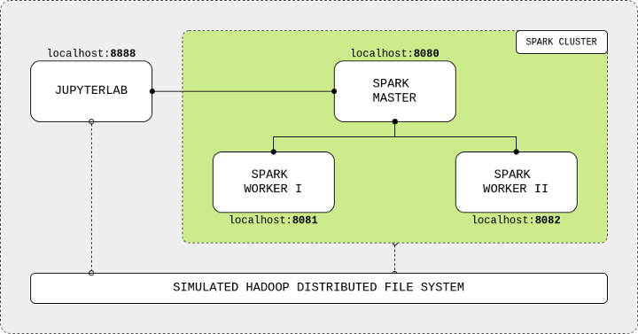
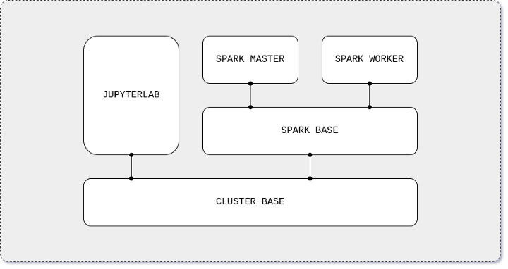

# Deploying Spark Cluster

Spark is a unified analytics engine for _large-scale_ data processing. It provides high-level APIs in Scala, Java, Python, and R, and an optimized engine that supports general computation graphs for data analysis. It also supports a rich set of higher-level tools including Spark SQL for SQL and DataFrames, pandas API on Spark for pandas workloads, MLlib for machine learning, GraphX for graph processing, and Structured Streaming for stream processing.

In this case, we are deploying a cluster of Spark nodes with a Jupyterlab interface as client of the spark node. The master node processes the input and distributes the computing workload to workers nodes, sending back the results to the IDE. The components are connected using a localhost network and share data among each other via a shared mounted volume that simulates an HDFS. The docker will have the following structure:





## Cluster Base Image

The cluster base image will download and install common software tools (Java, Python, etc.) and will create the shared directory for the HDFS. On the Spark base image, the Apache Spark application will be downloaded and configured for both the master and worker nodes. The Spark master image will configure the framework to run as a master node. Similarly, the Spark worker node will configure Apache Spark application to run as a worker node. Finally, the JupyterLab image will use the cluster base image to install and configure the IDE and PySpark, Apache Spark’s Python API. The Dockerfile is as follows:

```dockerfile
ARG debian_buster_image_tag=8-jre-slim
FROM openjdk:${debian_buster_image_tag}

# -- Layer: OS + Python 3.7

ARG shared_workspace=/opt/workspace

RUN mkdir -p ${shared_workspace} && \
    apt-get update -y && \
    apt-get install -y python3 && \
    ln -s /usr/bin/python3 /usr/bin/python && \
    rm -rf /var/lib/apt/lists/*

ENV SHARED_WORKSPACE=${shared_workspace}

# -- Runtime

VOLUME ${shared_workspace}
CMD ["bash"]
```

First, we have to choose a LinuxOS version. _Apache Spark official GitHub repository has a Dockerfile for Kubernetes deployment that uses a small Debian image with a built-in Java 8 runtime environment (JRE)_. By choosing the same base image, we solve both the OS choice and the Java installation. Then, we get the latest Python release (currently 3.7) from Debian official package repository and we create the shared volume.
