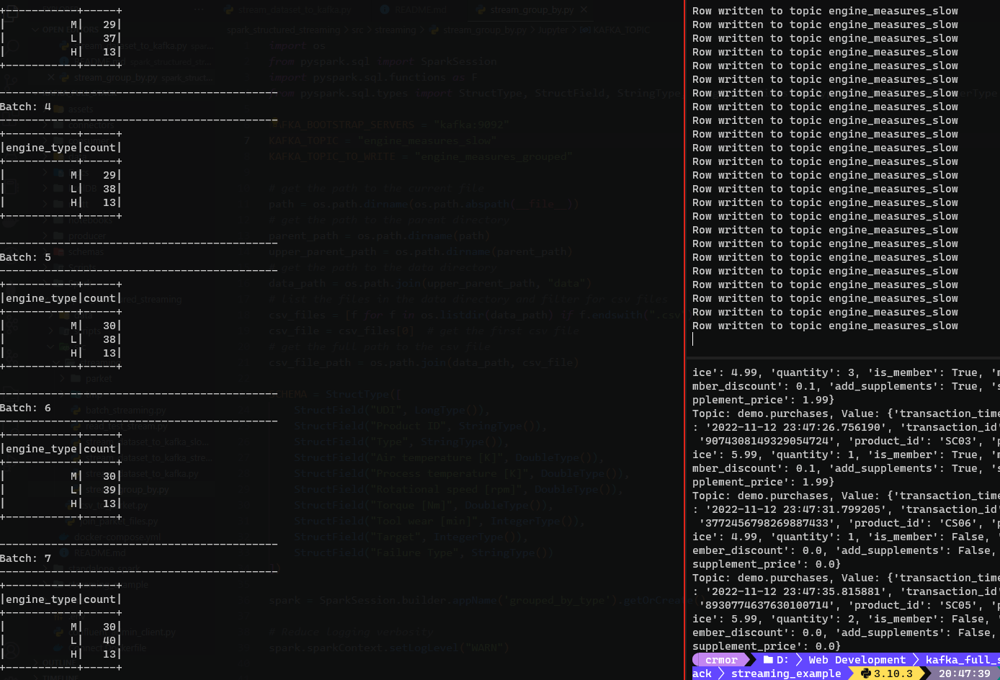

# The application

Taken and adapted from [HERE](https://towardsdatascience.com/a-fast-look-at-spark-structured-streaming-kafka-f0ff64107325)

We’ll be using the data from traffic sensors in the city of Belo Horizonte (BH), the capital of Minas Gerais (Brazil). It’s a huge dataset containing measurements of traffic flow in several places in the city. Each sensor periodically detects the type of vehicle driving at that location (car, motorcycle, bus/truck), its speed and length (and other information that we’re not going to use).

This dataset represents precisely one of the classical applications for streaming systems — a group of sensors sending their readings continuously from the field.

In this scenario, Apache Kafka can be used as an abstraction layer between the sensors and the applications that consume their data.

With this kind of infrastructure, it’s possible to build all sorts of (the so-called) [real-time event-driven systems](https://www.kai-waehner.de/blog/2022/09/29/real-time-logistics-shipping-transportation-with-apache-kafka/), like a program to detect and alert for traffic jams when the number of vehicles suddenly increases with a drop in average speed.

And that’s where Apache Spark comes into play.

It has a native module for stream processing called Spark Structured Streaming, that can connect to Kafka and process its messages.

## Setting up the environment

We are using the following image from Spark:

- https://hub.docker.com/r/bitnami/spark

```yaml
services:
  spark:
    image: docker.io/bitnami/spark:3.3
    container_name: spark-master
    environment:
      - SPARK_MODE=master
    ports:
      - "8080:8080"
      - "4040:4040"
      - "7077:7077"
    volumes:
      - ./data:/data
      - ./src:/src

  spark-worker:
    image: docker.io/bitnami/spark:3.3
    container_name: spark-worker
    environment:
      - SPARK_MODE=worker
      - SPARK_MASTER_URL=spark://spark:7077
      - SPARK_WORKER_MEMORY=4G
      - SPARK_EXECUTOR_MEMORY=4G
      - SPARK_WORKER_CORES=4

    volumes:
      - ./data:/data
      - ./src:/src
```

First we have to vreate a topic in Kafka to stream the data:

```bash
docker-compose exec kafka kafka-topics --create --topic traffic --partitions 1 --replication-factor 1 --if-not-exists --zookeeper zookeeper:2181
```

## First application

The code needs to be put inside the `/src/streaming` folder (nothing special, just the folder that I chose).

The key thing to note is that we’re using the attributes `readStream` and `writeStream`, instead of normal `read` and `write`. This is the main aspect that makes Spark treats our job as a streaming application.

To connect to Kafka, it is necessary to specify the server and topic. The option `startingOffsets=“earliest”` tells Spark to read the topic from the beginning. Also, because Kafka stores its messages in binary form, they need to be decoded to string.

The other options will be further explored.

Now, let’s access the Spark container and run the job from `home/` directory.

```bash
docker exec spark-master spark-submit --packages org.apache.spark:spark-sql-kafka-0-10_2.12:3.3.0 /src/streaming/read_test_stream.py
```

```python
from pyspark.sql import SparkSession

KAFKA_BOOTSTRAP_SERVERS = "kafka:9092"
KAFKA_TOPIC = "test_topic"

spark = SparkSession.builder.appName("read_test_straeam").getOrCreate()

# Reduce logging
spark.sparkContext.setLogLevel("WARN")

df = spark.readStream.format("kafka") \
    .option("kafka.bootstrap.servers", KAFKA_BOOTSTRAP_SERVERS) \
    .option("subscribe", KAFKA_TOPIC) \
    .option("startingOffsets", "earliest") \
    .load()

df.selectExpr("CAST(key AS STRING)", "CAST(value AS STRING)") \
    .writeStream \
    .format("console") \
    .outputMode("append") \
    .start() \
    .awaitTermination()
```

Spark Streaming works in micro-batching mode, and that’s why we see the “batch” information when it consumes the messages. The default batch interval is 1 second, but it can be changed with the option `trigger`.

_Micro-batching is somewhat between full “true” streaming, where all the messages are processed individually as they arrive, and the usual batch, where the data stays static and is consumed on-demand. Spark will wait some time trying to accumulate messages to process them together, reducing overhead and increasing latency. This can be tuned to your needs._

## READ FROM KAFKA AND STREAM

In this case we are reading from a topic and streaming the data to a console. The data has a schema represented in the structure. After that we are using the `writeStream` to stream the data to the console.

As we’re reading from the topic, we need to convert the JSON binary strings back to the columnar format.

Once this is done, the query can be built as usual. It’s interesting to note that the query heart is just the `select().groupBy().count()` sequence, all the rest is relative to streaming logic.

The output mode of a stream application specifies how we want to (re)compute and write the results as new data arrives.
It can assume three different values:

- Append: Only add new records to the output.
- Complete: Recompute the full result for each new record.
- Update: Update changed records.

These modes can or cannot make sense depending on the application written. For example, the “complete” mode may not make sense if any grouping or sorting is performed.

```python
SCHEMA = StructType([
    StructField("UDI", LongType()),
    StructField("Product ID", StringType()),
    StructField("Type", StringType()),
    StructField("Air temperature [K]", DoubleType()),
    StructField("Process temperature [K]", DoubleType()),
    StructField("Rotational speed [rpm]", DoubleType()),
    StructField("Torque [Nm]", DoubleType()),
    StructField("Tool wear [min]", IntegerType()),
    StructField("Target", IntegerType()),
    StructField("Failure Type", StringType())
])

spark = SparkSession.builder.appName('grouped_by_type').getOrCreate()

# Reduce logging verbosity
spark.sparkContext.setLogLevel("WARN")


df_grouped_stream = spark.readStream.format("kafka")\
    .option("kafka.bootstrap.servers", KAFKA_BOOTSTRAP_SERVERS)\
    .option("subscribe", KAFKA_TOPIC)\
    .option("startingOffsets", "earliest")\
    .load()

df_grouped_stream = df_grouped_stream\
    .select(
        F.from_json(
            # decode string as iso-8859-1
            F.decode(F.col("value"), "iso-8859-1"),
            SCHEMA
        ).alias("value")
    )\
    .select("value.*")\
    .select(
        F.col("Type").alias("engine_type"),
    )\
    .groupBy("engine_type")\
    .count()\
    .writeStream\
    .outputMode("complete")\
    .format("console")\
    .start()\
    .awaitTermination()
```



As new records are inserted in the stream, the job recomputes the full result. This can be useful in situations where row ordering is important, like ranking or competition. However, this approach may not be optimal if the number of groups is too big or the individual changes do not impact the overall result.

So, another option is to use the “update” output mode, which generates a new message only for the groups that have changed.

The “append” mode is not available to queries with grouping, so I’ll not be able to show using the same job. But I think that it is the simplest mode, it always adds a new record to the output.

## Tumbling time window — Aggregating using time intervals

In streaming systems, messages have two different timestamps related to them: **Event time** — The time when the message was created, in our case the sensor’s reading time, and **Processing time** — When the message is read by the processing agent, in our case when it reaches Spark.

_An important feature of stream processing tools is the ability to handle event time processing. Tumbling windows are non-overlapping fixed time intervals used to make aggregations using event-time columns. To put it more simply, they slice the timeline into equally sized slices so each event belongs to a single interval._

For example, count, every 5 minutes, how many vehicles were detected in the last 5 minutes.


## References

[A Fast Look at Spark Structured Streaming + Kafka](https://towardsdatascience.com/a-fast-look-at-spark-structured-streaming-kafka-f0ff64107325)
[Spark By Examples | Learn Spark Tutorial with Examples](https://sparkbyexamples.com/)
